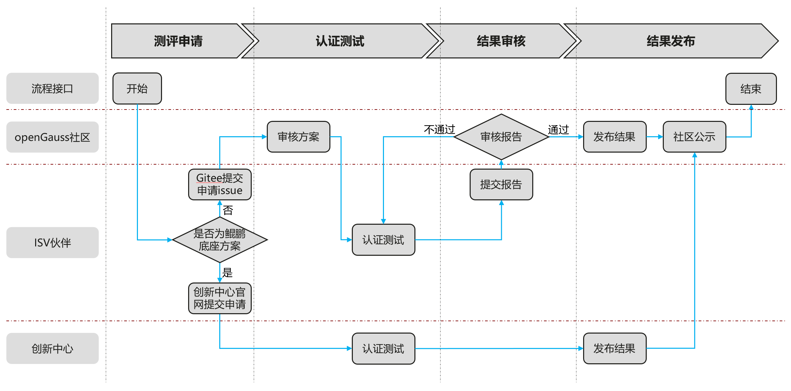

# compatible-certification

## 介绍
存放openGauss技术测评相关的文档，包括技术测评标准、流程、指导性文档等。

## 技术测评概述
openGauss技术测评：基于openGauss数据库（含开源版本和商业版本），对软件伙伴产品及解决方案，完成多样性算力平台下的兼容性验证测评。旨在联合伙伴构建基于面向数字基础设施的开源数据库生态竞争力，打造可信、高质量的根技术生态圈。

## openGauss兼容性技术测评流程

伙伴申请openGauss兼容性技术测评流程如下，有两种方式

### 方式一、鲲鹏创新中心测评流程
**（适用于鲲鹏硬件 + 欧拉系操作系统 + 高斯系数据库的全栈解决方案）**

- 步骤1. 伙伴访问[鲲鹏创新中心软件认证平台](https://ic-openlabs.huawei.com/client/#/software/certification), 选择按 Kunpeng Compatible 或 Kunpeng Validated 进行认证测试。

- 步骤2. 认证申请   
  ① 伙伴以解决方案合作伙伴账号登录认证平台   
  ② 按照平台要求填写申请信息，并提交以下材料：（1.企业logo; 2.解决方案主打胶片; 3.解决方案技术白皮书（可选）; 4.产品架构图; 5.产品说明书（可选）; 6.测试报告）   
  ③ 申请审核通过后，进入认证审核阶段   

- 步骤3. 测试方案设计   
  与合作伙伴联合完成测试方案设计，包括完成软件栈分析、硬件栈分析、测试用例设计等，输出伙伴认证测试方案设计文档。

- 步骤4. 认证测试   
  申请测试环境后，根据测试设计方案，执行测试用例进行功能和性能测试，使用兼容性测试工具获取兼容性测试结果。 测试结果提交测试报告在线生成服务，自动完成初审。   
    ① 测试环境申请，旗舰店提供满足要求的裸金属服务器和弹性云服务器，用于进行兼容性测试。   
    ② 测试执行，根据要求完成功能&性能测试，使用工具完成兼容性测试。   
    ③ 测试报告生成，生成满足兼容性、功能和性能等认证要求的测试验证报告，快速通过初审。   

- 步骤5. 测试报告审核   
  ① 创新中心旗舰店组织测试报告评审会，联合战略规划部完成伙伴提交的解决方案认证测试报告评审，输出评审结果。   
  ② 对审核通过的解决方案发起认证证书发放流程。   

- 步骤6. 证书发放   
  合作伙伴确认证书名称后，华为认证授予对应认证类型的认证证书，标志伙伴产品通过了测试认证，获得华为认可与证书使用授权   

说明：   
  ① 认证操作相关内容，请访问鲲鹏展翅认证[相关指导](https://ic-openlabs.huawei.com/openlab/#/knowledgebase?task_id=ENTRY_0106)   
  ② openGauss社区会定期将鲲鹏技术认证结果同步至官网[兼容性列表](https://opengauss.org/zh/compatibility/)进行展示   
  ③ 如获取鲲鹏技术认证书后，仍需获取独立的openGauss技术认证书，请联系 certification@opengauss.org   

### 方式二、openGauss社区测评流程
**（适用于其他 + openGauss社区版的解决方案）**

- 步骤1. 账号注册   
  伙伴完成Gitee账号注册，签署[openGauss 社区贡献者许可协议（CLA）](https://clasign.osinfra.cn/sign/Z2l0ZWUlMkZvcGVuZ2F1c3M=)。进入个人中心完善企业信息，提供包括企业营业执照，企业邮箱等，提交后系统会自动进行审核   

- 步骤2. 提交申请   
  伙伴根据[测试报告模板](testing-standard/openGauss技术测评兼容性测试用例（ISV商用软件）模板.docx)，结合自身产品使用方法，输出测评方案。并在compatible-certification仓库按[issue提交模板](docs/兼容性测评申请模板--issue提交模板.txt)发起测评申请   

- 步骤3. 审核方案   
  兼容性认证SIG组会对测评方案进行审核并反馈修改意见   

- 步骤4. 认证测试   
  伙伴根据测评方案进行测试，提交测试报告及数据库审计日志   

- 步骤5. 报告审核   
  兼容性认证SIG组会按双周例会的方式，对测试报告进行评审并输出结论   

- 步骤6. 证书确认   
  通过评审后即进入证书发放流程，此阶段社区会先对证书信息进行预制，并与伙伴对证书信息进行二次确认   

- 步骤7. 社区公示   
  伙伴对证书信息确认无误后，社区会完成证书的正式签发，并定期刷新至官网[兼容性列表](https://opengauss.org/zh/compatibility/)   

## 技术测评标准

**表1**  高斯技术测评标准

| 技术测评伙伴 | 技术测评对象      | 证书类型       | 说明                                                         |
| -------- | ------------- | -------------- | ------------------------------------------------------------ |
| ISV      | ISV商用软件   | 兼容性技术测评证书 | 认定ISV商业应用与高斯系数据库的兼容性，为使用高斯系数据库的伙伴提供商业选择 |

## 测试标准

**表2** 高斯技术测评测试标准

| 技术测评对象      | 用例基线                  | 测试工具               | 说明 |
| ------------ | ------------------------- | ---------------------- | ---- |
| ISV商用软件   | [ISV商用软件测试用例集](testing-standard/openGauss技术测评兼容性测试用例（ISV商用软件）模板.docx)     | gsql|      |

## 参与贡献

1.  Fork 本仓库
2.  新建 Feat_xxx 分支
3.  提交代码
4.  新建 Pull Request