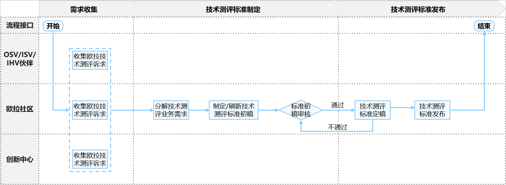
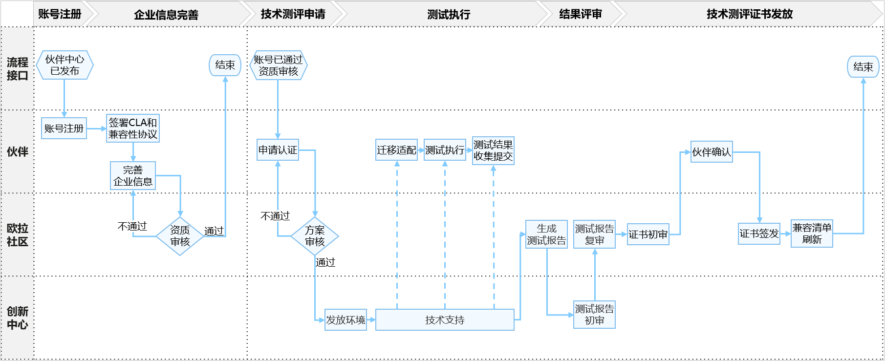

# compatible-certification

## 介绍
本仓库存放openGauss兼容性技术测评相关的文档及工具：包括技术测评标准、流程、测评工具等

## 兼容性技术测评概述
openGauss兼容性技术测评范围是：openGauss发行版，包含社区开源版和DBV商业发型版，与软件伙伴产品及解决方案，完成的兼容性验证测试。旨在联合伙伴构建openGauss生态竞争力，打造可信、高质量的数据库技术生态圈。

## openGauss兼容性技术测评标准发布流程
openGauss兼容性技术测评标准确认和发布的流程如下：

- 步骤1. 兼容性技术测评maintainer收集伙伴（ISV/DBV伙伴）、openGauss社区、创新中心对于openGauss兼容性技术测评的诉求。
- 步骤2. 分析收集的诉求，分解技术测评业务需求，并制定/刷新技术测评标准。
- 步骤3. 在Certification SIG组例会上发起议题，由Certification SIG组全体成员审核并确认最终结果，形成技术测评标准终稿。
- 步骤4. 确认终稿后，在openGauss兼容性技术测评仓库发布标准。

## openGauss兼容性技术测评流程

伙伴申请openGauss兼容性技术测评流程如下：

- 步骤1. 伙伴访问[技术测评平台](https://certification.opengauss.org), 账号注册登录后，签署CLA和兼容性协议。
- 步骤2. 签署完协议后，进入个人中心完善企业信息，包括企业营业执照，企业邮箱等等，提交后系统会自动进行审核，通过审核后才可进行方案申请。
- 步骤3. 完成协议签署和企业资质审核后，伙伴即可提交兼容性技术测评方案申请，申请时需提交信息包括：产品名称和版本、产品类型、产品介绍、所属行业、数据库版本、硬件平台，确认信息无误后，即可提交方案，由Certification SIG进行审核。
- 步骤4. 通过审核后，如果伙伴缺少测试环境，可在创新中心申请测试资源，创新中心会根据伙伴方案的需求，发放对应的测试环境，之后协助伙伴进行迁移适配、按照[测试标准](#测试标准)测试执行和测试结果收集提交，并最终生成测试报告。
- 步骤5. 生成报告后，伙伴需将测试报告提交到兼容性技术测评平台对应的方案中，由创新中心和Certification SIG对测试报告进行评审。
- 步骤6. 通过评审后，即进入证书发放流程，此阶段openGauss社区会先对证书信息进行初审，通过后由伙伴对证书信息进行二次确认。
- 步骤7. 如社区和伙伴双方都对证书信息确认无误，社区进行证书的签发，并自动同步刷新到兼容性清单，完成整个流程。

说明：详细的平台使用指引请见技术测评平台指导书。

## 兼容性技术测评标准

**表1**  openGauss兼容性技术测评标准

| 技术测评伙伴 | 技术测评对象      | 证书类型       | 说明                                                         |
| -------- | ------------- | -------------- | ------------------------------------------------------------ |
| ISV      | ISV商用软件   | 兼容性技术测评证书 | 认定ISV商业应用与openGuass发行版的兼容性，为使用openGauss发行版的伙伴提供商业选择 |
| DBV      | DBV商用发行版 | 兼容性技术测评证书 | 认定ISV商业应用与DBV发行版的兼容性，为使用DBV发行版的伙伴提供商业选择    |

## 测试标准

**表2** openGauss兼容性技术测评测试标准

| 技术测评对象      | 用例基线                  | 测试工具               | 说明 |
| :------------ | ------------------------- | ---------------------- | ---- |
| ISV商用软件   | [ISV商用软件测试用例集](testing-standard/openGauss兼容性技术测评兼容性测试用例-ISV商用软件.md)     | xxx             |      |

## 参与贡献

1.  Fork 本仓库
2.  新建 Feat_xxx 分支
3.  提交代码
4.  新建 Pull Request