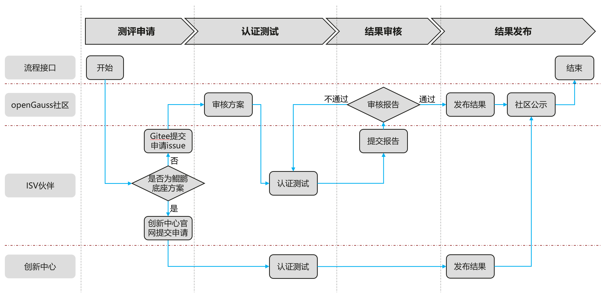

# compatible-certification

## 介绍
存放openGauss技术测评相关的文档，包括技术测评标准、流程、指导性文档等。

## 技术测评概述
openGauss技术测评：基于openGauss数据库（含开源版本和商业版本），对硬件伙伴、软件伙伴产品及解决方案，完成多样性算力平台下的兼容性验证测评。旨在联合伙伴构建基于面向数字基础设施的开源数据库生态竞争力，打造可信、高质量的根技术生态圈。

## openGauss兼容性技术测评流程

伙伴申请openGauss兼容性技术测评流程如下，有两种方式

### 方式一、鲲鹏创新中心测评流程
**（面向ISV、OSV伙伴，适用于鲲鹏硬件 + openEuler系操作系统 + openGauss系数据库的全栈解决方案）**

- 步骤1. [登录鲲鹏社区](https://www.hikunpeng.com/document/detail/zh/kunpengfaq/communityfaq/devpartpfaq/kunpeng_swpp_0001.html)

- 步骤2. [登录生态伙伴中心](https://www.hikunpeng.com/document/detail/zh/kunpengfaq/communityfaq/devpartpfaq/kunpeng_swpp_0002.html)

- 步骤3. 提交申请和方案信息填写

- 步骤4. 查看认证进度和驳回处理   

- 步骤5. 伙伴确认证书信息

- 步骤6. 伙伴上传签章

- 步骤7. 查看和下载技术证书

说明：   
  ① 鲲鹏技术认证操作相关内容，请访问鲲鹏展翅认证[相关指导](https://www.hikunpeng.com/document/detail/zh/techcert/certapp/certug/kunpeng_atc_0002.html)   
  ② 在获取鲲鹏技术认证书后，可复用结果通过邮件申请openGauss兼容性证书。复认证申请请联系 certification@opengauss.org   

### 方式二、openGauss社区测评流程
**（面向ISV、OSV、IHV伙伴，适用于其他 + openGauss社区版的解决方案）**

- 步骤1. 账号注册   
  伙伴完成Gitee账号注册，签署[openGauss 社区贡献者许可协议（CLA）](https://clasign.osinfra.cn/sign/gitee_opengauss-1614047760000855378)，提交后系统会自动进行审核   

- 步骤2. 提交申请   
  伙伴根据产品类型，参考测试标准选择对应的报告模板，结合自身产品使用方法，输出测评方案。并在compatible-certification仓库按[issue提交模板](docs/兼容性测评申请模板--issue提交模板.txt)发起测评申请   

- 步骤3. 审核方案   
  兼容性认证SIG组会对测评方案进行审核并反馈修改意见   

- 步骤4. 认证测试   
  伙伴根据测评方案进行测试，提交测试报告及数据库审计日志（操作系统及硬件类型的兼容性测评，还需另外提交测试用例执行时的录屏文件）   

- 步骤5. 报告审核   
  兼容性认证SIG组会按双周例会的方式，对测试报告进行评审并输出结论   

- 步骤6. 证书确认   
  通过评审后即进入证书发放流程，此阶段社区会先对证书信息进行预制，并与伙伴对证书信息进行二次确认   

- 步骤7. 社区公示   
  伙伴对证书信息确认无误后，社区会完成证书的正式签发，并定期刷新至官网[兼容性列表](https://opengauss.org/zh/compatibility/)   

## 技术测评标准

**表1**  openGauss技术测评标准

| 技术测评伙伴 | 技术测评对象      | 证书类型       | 说明                                                         |
| -------- | ------------- | -------------- | ------------------------------------------------------------ |
| ISV      | ISV商用软件   | 兼容性技术测评证书 | 认定ISV商业应用与openGauss系数据库的兼容性，为使用openGauss系数据库的伙伴提供商业选择 |
| OSV      | OSV操作系统    | 兼容性技术测评证书 | 认定OSV操作系统与openGauss系数据库的兼容性，为使用openGauss系数据库的伙伴提供商业选择 |
| IHV      | IHV硬件产品    | 兼容性技术测评证书 | 认定IHV硬件产品与openGauss系数据库的兼容性，为使用openGauss系数据库的伙伴提供商业选择 |

## 测试标准

**表2** openGauss技术测评测试标准

| 技术测评对象      | 用例基线                  | 测试工具               | 说明 |
| ------------ | ------------------------- | ---------------------- | ---- |
| ISV商用软件   | [ISV商用软件测试用例集](testing-standard/openGauss技术测评兼容性测试用例（ISV商用软件）模板V3.docx)     | gsql|      |
| OSV操作系统   | [OSV操作系统测试用例集](testing-standard/openGauss技术测评兼容性测试用例（操作系统）模板V2.docx)     |    |      |
| IHV硬件产品   | [IHV硬件产品测试用例集](testing-standard/openGauss技术测评兼容性测试用例（硬件伙伴）模板.docx)     |    |      |

## 参与贡献

1.  Fork 本仓库
2.  新建 Feat_xxx 分支
3.  提交代码
4.  新建 Pull Request