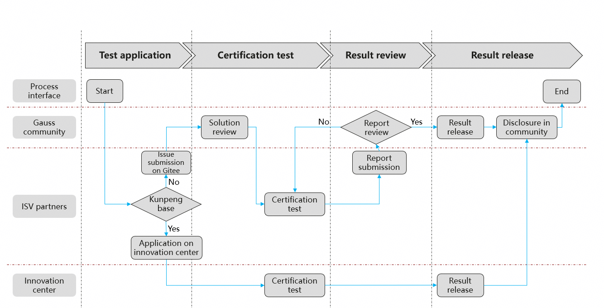

# compatible-certification

## Introduction

This section stores documents related to openGauss technical evaluation, including technical evaluation criteria, processes, and guidance documents.

## Technical Evaluation Overview

openGauss technical evaluation: Verify and evaluate the compatibility of products and solutions of hardware and software partners based on openGauss database (including open-source and commercial versions). The purpose is to work with partners to build the competitiveness of the open-source database ecosystem based on digital infrastructure and build a trustworthy and high-quality root technology ecosystem.

## openGauss Compatibility Technical Evaluation Process

The following figure shows two ways:

### Method 1: Kunpeng Innovation Center Evaluation Process

**(For ISVs and OSVs with full-stack solutions of Kunpeng hardware, openEuler OSs, and openGauss databases)**

- Step 1. [Log in to the Kunpeng community](https://www.hikunpeng.com/document/detail/zh/kunpengfaq/communityfaq/devpartpfaq/kunpeng_swpp_0001.html).

- Step 2. [Log in to the Ecosystem Partner Center](https://www.hikunpeng.com/document/detail/zh/kunpengfaq/communityfaq/devpartpfaq/kunpeng_swpp_0002.html).

- Step 3. Submit the application and fill in the solution information.

- Step 4. View the certification progress and handle the rejected application.  

- Step 5. Confirm the certificate information.

- Step 6. Upload the partner's signature.

- Step 7. View and download the technical certificate.

Note:  

  1. For details about how to obtain the Kunpeng technical certificate, visit the Kunpeng certification [related guide](https://www.hikunpeng.com/document/detail/zh/techcert/certapp/certug/kunpeng_atc_0002.html).  
  2. After obtaining the Kunpeng technical certificate, you can reuse the result to apply for the openGauss compatibility certificate by email. For re-certification application, contact <certification@opengauss.org>.  

### Method 2: openGauss Community Evaluation Process

**(For ISVs, OSVs, and IHVs with solutions of other products or openGauss community edition)**

- Step 1. Register an account.  
  Register a Gitee account, sign the openGauss Community Contributor License Agreement [CLA](https://clasign.osinfra.cn/sign/gitee_opengauss-1614047760000855378), and submit the application. The system will automatically review the application.  

- Step 2. Submit an application.  
  Select a report template based on the product type and test standards, and output an assessment solution based on the product usage method. Submit an assessment application in the compatible-certification repository using the [issue submission template](docs/Compatibility Assessment Application Template - Issue Submission Template .txt).  

- Step 3. Review the solution.  
  The compatibility certification SIG will review the test plan and provide modification suggestions.  

- Step 4. Perform the certification test.  
  Partners perform the test according to the test plan and submit the test report and database audit logs. (For the compatibility test of the OS and hardware, the screen recording file of the test case execution must be submitted.)  

- Step 5. Review the report.  
  The compatibility certification SIG will review the test report and provide the conclusion at the biweekly meeting.  

- Step 6. Confirm the certificate.  
  After the review is passed, the certificate issuance process begins. In this phase, the community preconfigures the certificate information and confirms the information with the partner.  

- Step 7. Certification is publicly disclosed within the community.  
  After the partner confirms the certificate information, the community officially issues the certificate and periodically updates the compatibility list on the official website <https://opengauss.org/zh/compatibility/>.  

## Technical Test Standards

**Table 1** openGauss technical test standards

| Test Partner| Test Object     | Certificate Type      | Description                                                        |
| -------- | ------------- | -------------- | ------------------------------------------------------------ |
| ISV      | ISV commercial software  | Compatibility evaluation certificate| Certifies the compatibility between ISV commercial applications and openGauss databases.|
| OSV      | OSV operating system   | Compatibility evaluation certificate| Certifies the compatibility between OSV operating system and openGauss databases.|
| IHV      | IHV hardware products   | Compatibility evaluation certificate| Certifies the compatibility between IHV hardware products and openGauss databases.|

## Test Standards

**Table 2** openGauss technical test standards

| Test Object     | Test Case Baseline                 | Test Tool              | Description|
| ------------ | ------------------------- | ---------------------- | ---- |
| ISV commercial software  | [ISV commercial software test case set](testing-standard/openGauss technical test compatibility test cases (ISV commercial software) template V3.docx)    | gsql|      |
| OSV operating system  | [OSV operating system test case set](testing-standard/openGauss technical test compatibility test cases (operating system) template V2.docx)    |    |      |
| IHV hardware products  | [IHV hardware product test case set](testing-standard/openGauss technical test compatibility test cases (hardware partners) template .docx)    |    |      |

## Contributions

1. Fork this repository.
2. Create a Feat_xxx branch.
3. Commit code.
4. Create a pull request (PR).
